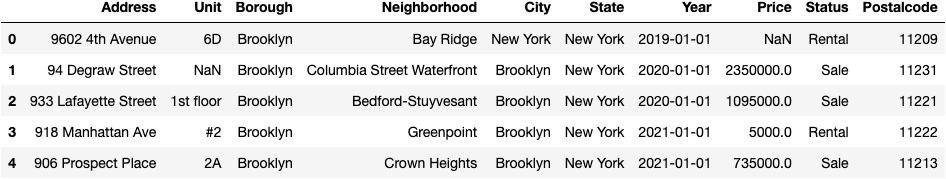
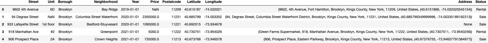
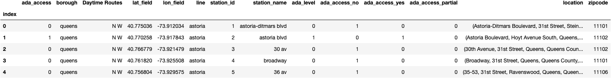
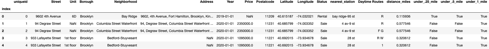

# Golan Team Real Estate Estate Transactions


## TABLE OF CONTENTS
* [Overview](#first-bullet)
* [Tools](#second-bullet)
* [Part 1 - Initial Cleaning & DataType Conversion](#third-bullet)
* [Part 2 - Transform - Geocode Latitude & Longitude Using Geopy Nominatim - Re Estate Dataset ](#fourth-bullet)
* [Part 3 - Transform - Geocode Zipcode Using Geopy Nominatim - MTA Subway Station Dataset (#fifth-bullet)
* [Part 4 - Transform - Determining Closest Subway Using Sklearn & Dataframe Merge](#sixth-bullet)
* [Part 5 - Visualizations - Folium Circle Marker Map] (#seventh-bullet)

## Overview <a class="anchor" id="first-bullet"></a>

## Tools <a class="anchor" id="second-bullet"></a>

## Part 1 Header <a class="anchor" id="third-bullet"></a>

## Part 2 Header <a class="anchor" id="fourth-bullet"></a>

## Part 3 Header <a class="anchor" id="fifth-bullet"></a>

## Part 4 Header <a class="anchor" id="sixth-bullet"></a>

## Part 5 Header <a class="anchor" id="seventh-bullet"></a>

# Overview
* The datasets created and utilized for our analysis and visualizations took data on Real Estate Sales and MTA Subway Stations. The RE dataset was expanded upon using API calls to find the exact coordinates for each property. Similar API calls for the Subway Data were used to append a zipcode column. After merging both datasets, I leveraged sklearn.neighbors and calculated Haversine distance formula to find the subway station in closest proximity the property and the distance in miles from the station to display walkability to mass transit on future maps. After finalizing my unique dataset, maps were created using folium to display the Real Estate team's performance across time and geography.

* Tools Used: python, pandas, numpy, sklearn.preprocessing [oneHotEncoder], geopy[distance], geopy.geocoders[Nominatim], geopy.exc[GeoCoderTimedOut], geopy.extra.rate_limiter[RateLimiter], geopandas, plotly_express, tqdm, tqdm.pandas(), sklearn.neighbors, tqd, datetime, tqdm_notebook, webbrowser, sklearn.neighbors, folium, nbconvert.

#### Part 1 - Initial Cleaning & DataType Conversion
     
* To see the full column values and better visualize the data before reading in the csv I used ```pd.set_option('max_colwidth', 800)```

* Checked datatypes ```df.dtypes``` and converted year int64 to datetime using ```df['Year'] = pd.to_datetime(df['Year'], format='%Y')```

* The dataset also contained sales outside of NYC in NJ, MD and CT but the focus is New York City so I filtered using a Boolean Mask.
  
  ```
  # Apply Filter
  filtered = df['State'] == 'New York'
  full = df[filtered]
  ```
* To prepare the data for the geocoding API, I concatanated each column value that held geographic features. I created individual arrays to extract location column values individually.
  
   ```
  # Array creation for each geographic feature
  a = np.char.array(full['Street'].values)
  b = np.char.array(full['City'].values)
  c = np.char.array(full['State'].values)
  d = np.char.array(full['Postalcode'].values)
  
  # Merge 
  full['Location'] = a.astype(str) + ', ' + b.astype(str) + ', ' + c.astype(str) + ', ' + d.astype(str)

After initial cleaning, the dataframe looks like:



### Part 2 - Transform - Geocode Latitude & Longitude Using Geopy Nominatim - Real Estate Dataset 
##### Real Estate Transactions Dataset

* My ultimate goal is to play cartographer and visualize the Real Estate Transactions across geography. While the dataset provides a full address, I used an API call using the geopy to request lat/long coordinate pairs for future map-making.
* In order to geocode a pandas DataFrame with geopy you need to use RateLimiter. Geocode RateLimiter classes provides a convenient wrapper, which can be used to automatically add delays between geocoding calls to reduce the load. RateLimiter allows you perform bulk operations while handling error responses and adding delays to prevent time-outs.
* For documentation and install see https://geopy.readthedocs.io/en/stable/

```
  # Apply Geocode to the location column
  
  geocode = RateLimiter(geolocator.geocode, min_delay_seconds=1)
  full['Address'] = full['Location'].apply(geocode)
 
  # Take the data responses (latitude, longitude, alitude) from the API call and populate the data into the DataFrame Full column called "Address"
  
  full['point'] = full['Address'].apply(lambda loc: tuple(loc.point) if loc else None)
  full.point
  
  # Convert Data from DataFrame "Full" to a Series
  
  coordinates_series = full['point'].apply(pd.Series)
  coordinates_series
  
  # Add Latitude and Longitude as columns in dataframe
  
  full['Latitude'] = coordinates_series[0]
  full['Longitude'] = coordinates_series[1]
  
  # Find Missing Values by Creating a bool series True for NaN values 
  
  bool_series = pd.isnull(full["Latitude"]) 
  #bool_series = pd.isnull(full["Longitude"]) 
  
  # Displaying data only where columns = NaN 
  
  full[bool_series]
  
  # Add missing values in Lat/Long columns
  
  full.loc[2,'Latitude'] = 40.692015
  full.loc[2,'Longitude'] = -73.934678
  
```
The 2nd iteration of the dataframe after initial cleaning looks like:



### Part 3 - Geocode Zipcode Using Geopy Nominatim - MTA Subway Station Dataset
#### NYC Subway Stations Dataset

* Use``pd.get_dummies`` to generate binary values for whether the subway station is ADA-Accessiblle - Yes, No, Partially
* Ultimately, both the RE and Subway datasets needed to share zipcode as a common column to later perform a groupby function and merge. The dataset provided latitude and longitude values  however there was no zipcode field. The Geopy library was used to create an API to find all location descriptors, using the latitude longitude pairs.
  * Step 1: Establish a connection to APIs by setting up the geocoder. First import the geocoder you want to use, and initiate it.
  * Step 2: Use Rate limiter to add some delays in between the API requests.
  * Step 3: Create a function to retrieve information using the coordinates --> Output returns a dictionary
  * Step 4: Use ``.apply()`` with function to isolate only zipcode

```

# Use geolocator and append zipcode column to dataframe
reverse = RateLimiter(geolocator.reverse, min_delay_seconds=.01)

df['location'] = df.progress_apply(lambda row: reverse((row['lat_field'], row['lon_field'])),axis=1)
     
def parse_zipcode(location):
    if location and location.raw.get('address') and location.raw['address'].get('postcode'):
        return location.raw['address']['postcode']
    else:
        return None
df['zipcode'] = df['location'].apply(parse_zipcode)
```
 
The clean Subway Station dataframe looks like:


 
### Part 4 - Transform - Determining Closest Subway Using Sklearn & Dataframe Merge
#### Merging the Dataframes

* The original subway dataset provided binary encoding for ada-accessibility from the original data. To create a more interesting feature, we added a walk-score for each housing record using ``sklearn.neighbors`` library which implements the k-nearest neighbors vote and finds the shortest distance which required us to compare the latitude/longitude pairs for all 300+ housing records against 494 Subway stations to find the closest station and distance in miles.

 ```
# Challenge: Find the closest train station and approximate distance to each housing record using sklearn.neighbors

# Find the absolute value of each coordinate pair
def dist(lat1, long1, lat2, long2):
    return np.abs((lat1-lat2)+(long1-long2))

# Extract all lat/long values and save to variable
lat_column = housing.loc[:,'lat']
long_column = housing.loc[:,'long']
lats = lat_column.values
longs = long_column.values

# Apply lambda function across each column and if 1 apply the function to the row
distances = stations.apply(
    lambda row: dist(lats, longs, row['lat_field'], row['lon_field']), 
    axis=1)

# Use idxmin to calculate the closest station name

def find_station(lat, long):
    distances = stations.apply(
        lambda row: dist(lat, long, row['lat_field'], row['lon_field']), 
        axis=1)
    return stations.loc[distances.idxmin(), 'station_name']
    
# Find the closest station name to each recorded sale
closest_station = housing.apply(
    lambda row: find_station(row['lat'], row['long']), 
    axis=1)

#### Find the distance between two lists of geographic coordinates using Haversine Distance
# Convert latitude and longitude to radians and add these columns to the dataframe using np.radians

# Add columns with radians for latitude and longitude
housing[['lat_radians_housing','long_radians_housing']] = (
    np.radians(housing.loc[:,['lat','long']])
)

stations[['lat_radians_stations','long_radians_stations']] = (
    np.radians(stations.loc[:,['lat_field','lon_field']])
)

# Add unique ID column
housing['uniqueid'] = np.arange(len(housing))

# Append to housing dataframe
housing['distance_miles'] = minValuesObj
housing

# Use np.where to create Bool column --> True denotes less than 1 mile from train (lat/long in housing is zipcode based)
housing['under_1_mile'] = np.where(housing['distance_miles'] <= 1, True, False)
housing.head()

```
The 4th iteration of the clean (final) dataframe looks like:



Our dataset transformation is complete. Onto mapping!


### Part Five - Visualizations - Folium Circle Marker Map

* For Part Five, I made several Cluster Maps with increasing complexity.


#### Future Considerations
     *  I have not fully leveraged the tilelayer. The geojson file also has a Neighborhood feature that I would like to embed as a static label within the center of each polygon.
     *  This is an incomplete dataset, only reflecting a sample of The Golan Team Sales. Once more comprehensive, I will:
          * Add a link to the property url within the tooltip
          * Use the distance to the nearest train station (see Part Four) to display within the tooltip transit info with subway icons.
          * Visualize data over time
 
 
#### Additional Visualizations Coming Soon!
